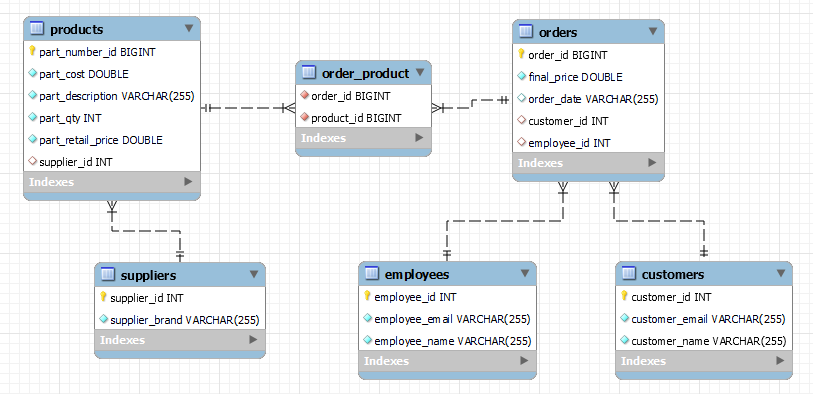

### Inventory Management Application

Basic Inventory Management application created with Java Spring, Thymeleaf and MySQL database.
Has possibility to create, delete and update: Products, Suppliers, Customers, Employees and Orders.

#### Used technologies:
- Spring Boot Web;
- Spring Data JPA & Hibernate,
- Thymeleaf;
- MySQL Database;
- Maven dependencies;
- HTML 5 & Bootstrap 4.
<!-- - JUnit & Spring Test.-->

#### Requirements:
- Java version 11 or higher.

### Screenshots

All CRUD functions implemented for all tables.

#### Tables & relations:
1. Supplier (Brand name or Category can be used instead);
2. Product with ProductId, Description, Qty, Unit Cost, Retail Price; 
     2.1. with @ManyToOne relation to Supplier.
3. Customer with CustomerId & Name. Optionally E-mail & Delivery Address can be added;
4. Employee with EmployeeId & Name. Optionally E-mail & Department;
5. Orders with OrderId, Customer & Employee names, List of Products (Descriptions of products) in the order, Total Order Sum, Order Date;
      5.1. with @ManyToMany relations to Products;
      5.2. and with @ManyToOne relations to Customer & to Employee.
